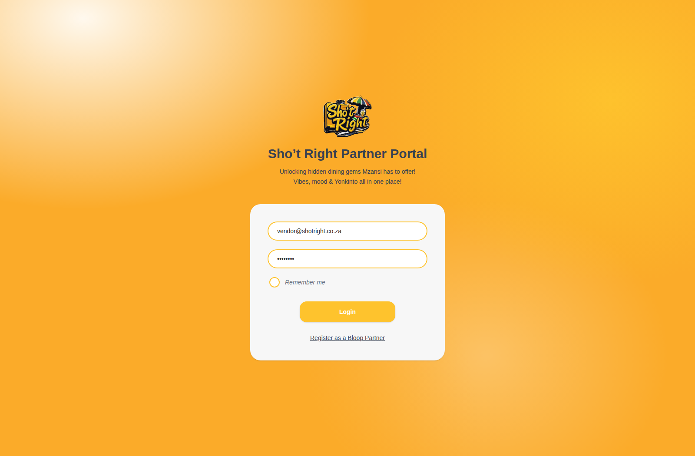
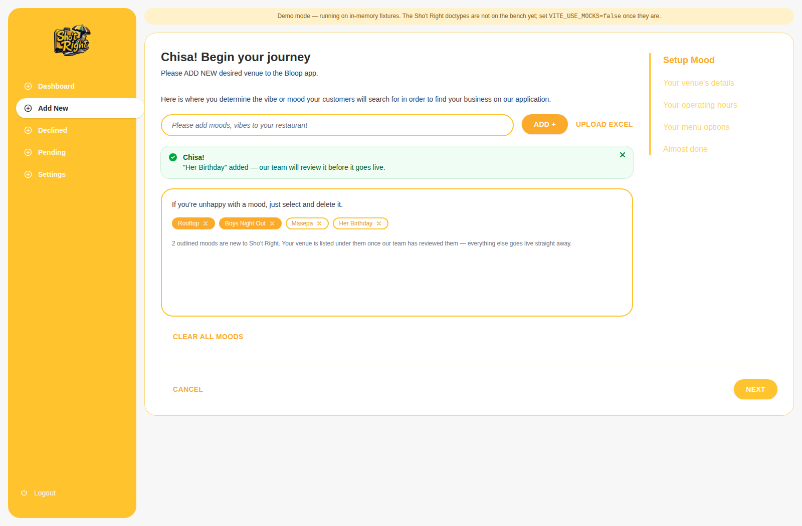
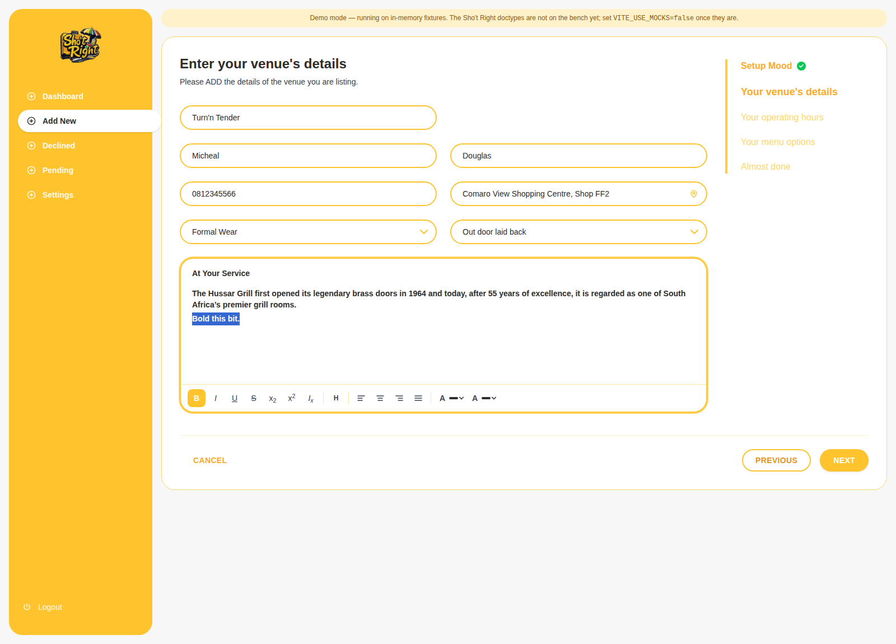
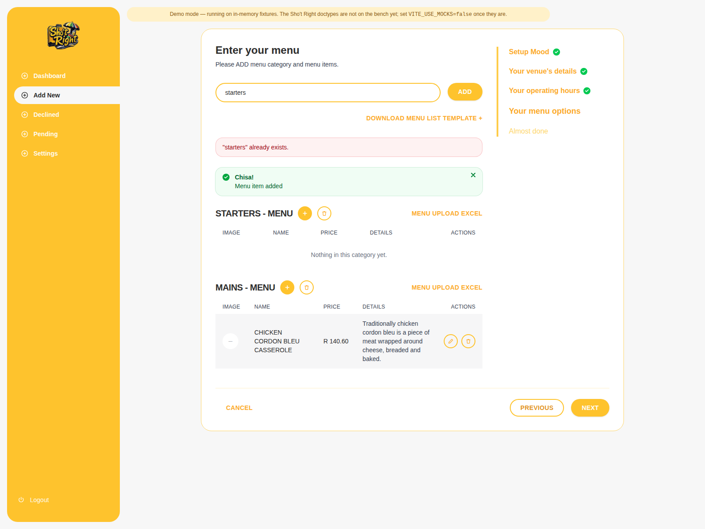
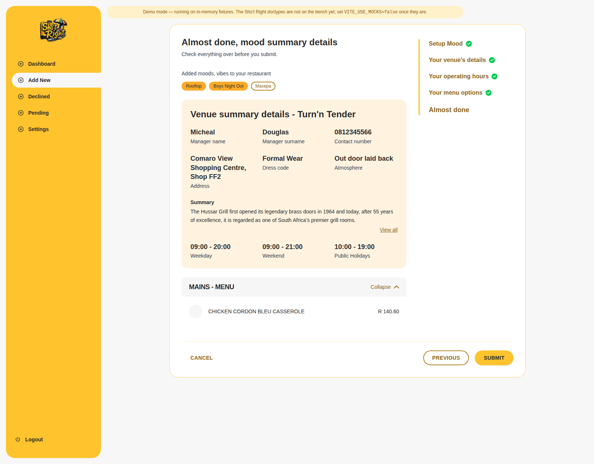
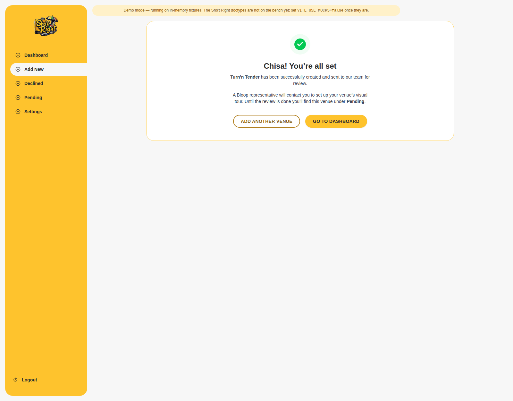

# Sho't Right Partner Portal — project update

**26 July 2026** · Session `session_01KxKyuWPd63AtzWiGo91Pr3` · logged as
`SL-2026-00091`

---

## Where we are

The Partner Portal is **built end to end**. A restaurant owner can register, log
in, and take a venue from nothing to submitted-for-review in one sitting: moods,
venue details, operating hours, menu, and a final check.

It lives in its own repo — **[`Mlu-ctrl-alt-design/shotright-portal`](https://github.com/Mlu-ctrl-alt-design/shotright-portal)**
— built from the 29 approved design frames.

---

## How to see it

> ### ⚠️ There is no live link yet
>
> **The portal is not deployed.** I could not deploy it from this session: there
> is no Vercel token available to it, and network access to `vercel.com` is
> blocked by the sandbox. A token alone would not have been enough.
>
> Everything needed is committed and correct — it is a two-minute import:
>
> 1. Go to **[vercel.com/new](https://vercel.com/new)** and import
>    `Mlu-ctrl-alt-design/shotright-portal`
> 2. Leave **Root Directory** at the repo root
> 3. Set `VITE_USE_MOCKS=true`; leave `VITE_API_BASE` **empty**
> 4. Deploy
>
> That gives a shareable URL running on demo data — which is genuinely useful
> right now, because the backend does not exist yet. Full steps and the reasoning
> are in [`docs/DEPLOYMENT.md`](DEPLOYMENT.md).
>
> **Before showing it to a real partner**, point a subdomain at it —
> `partners.thedaystar.co.za`. A `vercel.app` URL asking a restaurant owner for a
> password does not read as legitimate.

To run it locally in the meantime:

```bash
git clone https://github.com/Mlu-ctrl-alt-design/shotright-portal
cd shotright-portal && npm install && npm run dev
```

Credentials are pre-filled; in demo mode anything non-empty signs you in.

---

## What it looks like

**Login** — centred card on the warm wash, with the brand mark.



**Step 1 · Moods** — the partner types any mood they like. "Rooftop" and
"Boys Night Out" resolved onto existing moods and are live immediately; "Masepa"
is new, so it is outlined and goes to review before it reaches customer search.
Typing `boys night` is what produced the solid "Boys Night Out" pill.



**Step 2 · Venue details** — including a rich-text description with the toolbar
the designs specify.



**Step 4 · Menu** — categories, items with photos and prices, per-category Excel
upload and a downloadable template.



**Step 5 · Review** — everything on one screen before submitting.



**Submitted** — sets the expectation of the follow-up call for the 360° tour.



---

## Decisions taken

Four calls were needed before the build could finish. Each is recorded in the
[PRD](PRD-shot-right-partner-portal.md) §7.5.

| # | Decision |
|---|---|
| **C1** | Partners **type their own moods**. Text that matches a known mood or alias resolves to it; anything new becomes a suggestion for staff to merge. Not curated-only, as issue #15 had it. |
| **C3** | Operating hours are **weekday / weekend / public holiday**, not seven per-day rows — that is how the designs collect them, and how partners think. |
| **C4** | Menu item **images are stored on the bench**. |
| — | The portal **moved out of the Flutter repo** into its own. That repo now keeps only a pointer (PR #24, merged). |

---

## Accessibility

A full pass was done, and it found real problems. Nine colour combinations
failed WCAG AA — several badly:

| Where | Was | Needed |
|---|---|---|
| Buttons, day chips, sidebar nav | **1.61:1** | 4.5 |
| Links, ghost buttons, step rail | **1.92:1** | 4.5 |
| Upcoming step-rail entries | **1.40:1** | 4.5 |
| Every input and select border | **1.61:1** | 3.0 |

The cause is that the brand yellow is very light: it can carry dark text, but it
cannot *be* text or a border on white. So yellow stays a fill, and two darker
companions of the same hue carry the brand wherever contrast is required. Text on
yellow flipped from white to near-black, which reads at 8.56:1.

**All fifteen pairs now pass**, verified by computing the ratios rather than by
eye. Also added: a skip link, a visible focus style for the custom controls that
had none, live regions so alerts and toasts are announced, and reduced-motion
support.

**This is a deliberate deviation from the designs**, which specify white on
yellow throughout. The designs are not accessible as drawn. The identity is
unchanged — same yellow, same layout, darker text on it — but it needs a sign-off.

---

## What is not done

**The backend does not exist.** No Sho't Right doctypes are on the bench —
confirmed by querying it. The portal runs on in-memory fixtures, and every
integration point is isolated in one file so the switch is a config change.
[`docs/BACKEND-INTEGRATION.md`](BACKEND-INTEGRATION.md) is the handover: doctypes,
endpoint contracts, and a cutover checklist.

Three things need a person, not more frontend work:

1. **A Desk review queue for mood suggestions.** C1 creates them; nothing
   reviews them. Until it exists they pile up unseen and those venues never
   appear in customer search.
2. **Two undesigned screens** — Settings, and the path back for a partner whose
   venue is declined. Today a decline is a dead end.
3. **Server-side sanitisation of the rich text**, and image type/size limits.
   The client checks are feedback only; the API accepts whatever is posted.

---

## Suggested next steps

| Priority | What | Why |
|---|---|---|
| 1 | Deploy to Vercel + subdomain | Unblocks review and partner demos today |
| 2 | Scaffold the Frappe app and doctypes | Everything else waits on this |
| 3 | Design Settings and declined-recovery | Blocking the last two portal screens |
| 4 | Mood suggestion review queue | Silent failure mode if skipped |
